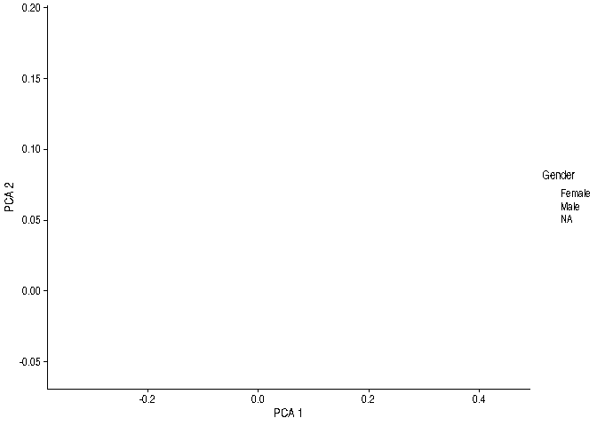

Lab 2: clustering & visualization
=================================

### Task 1. Visualize beta diversity

Use principal coordinate analysis (PCoA) and Bray-Curtis dissimilarities
for relative abundances

    # Add relative abundance transformation in the data
    tse_phylum <- relAbundanceCounts(tse_phylum)

    # To speed up examples, let us just look at Swedish individuals
    tse_subset <- tse_phylum[, tse_phylum$Geography == "Sweden"]

    # Perform PCoA (aka MDS) using Bray-Curtis dissimilarity for relative abundance data
    tse_subset <- scater::runMDS(tse_subset, FUN = vegan::vegdist, name = "PCoA_braycurtis",
                       method = "bray", exprs_values = "relabundance")

    # Visualize ordination
    scater::plotReducedDim(tse_subset, dimred="PCoA_braycurtis")

    ## Warning in grid.Call.graphics(C_points, x$x, x$y, x$pch, x$size): semi-
    ## transparency is not supported on this device: reported only once per page

    # Indicate sample gender by color
    scater::plotReducedDim(tse_subset, dimred="PCoA_braycurtis", colour_by="Gender")

    ## Warning in grid.Call.graphics(C_points, x$x, x$y, x$pch, x$size): semi-
    ## transparency is not supported on this device: reported only once per page

### 2. Same data with PCA and Aitchison distance (clr transformation + Euclidean distance)

    # Let us add CLR transformation in the assays
    tse_subset <- transformSamples(x = tse_subset, abund_values = "relabundance", method = "clr", 
                            pseudocount = 1, name = "CLR")

    # Perform MDS for CLR data with Euclidean distances (equals to PCA)
    tse_subset <- scater::runMDS(tse_subset, FUN = vegan::vegdist, name = "PCA",
                       method = "euclidean", exprs_values = "CLR")

    # Visualize ordination
    scater::plotReducedDim(tse_subset, dimred="PCA")

    ## Warning in grid.Call.graphics(C_points, x$x, x$y, x$pch, x$size): semi-
    ## transparency is not supported on this device: reported only once per page

    # Indicate sample gender by color
    scater::plotReducedDim(tse_subset, dimred="PCA", colour_by="Gender")

    ## Warning in grid.Call.graphics(C_points, x$x, x$y, x$pch, x$size): semi-
    ## transparency is not supported on this device: reported only once per page

